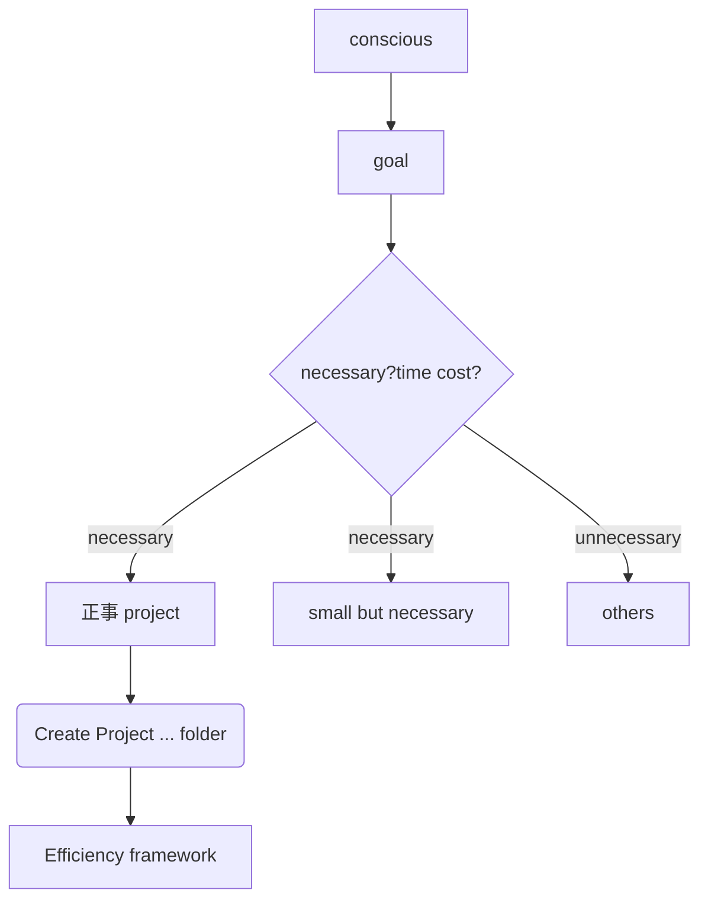

goal1. 找一份工作，高速增长的规模大的市场，离客户近的岗位
	t0. 确定高速增长的规模大的市场, 2026-03-20
		ruturn "ai agent 是很好的方向"❓
	t2. 获得一份ai agent的工作
		a0. 查找如何获得
			return <https://www.youtube.com/watch?v=uqbRxjtIJks&t=503s>
		a1. a0建议如下
			1. 买claude code最大会员
				return buy gpt pro, use codex intead of it
			2. 做独立实现的 用其他语言的 带memory，muti agent的opencode and openclaw project
			3. 可以使用[OnlySpec](OnlySpecshttps://github.com/lidangzzz/OnlySpecs) 来实现
		a2. 发现AI总是污染机器环境,尝试docker解决
			4. WSL2 是什么呢❓
			5. docker 实践 


## conscious goal framework

Improve Efficiency

framework visual


```md
## goal. xxx

task0 = [action,ddl]
task1 = [action,ddl]
```

几个task是一天的任务量

"just do it"

all sight or ideas --> [[others]] --> 


Template of [[Small but necessary]]

```
goal = 
prompt/feedback = 
next,ddl,cost =  

```
