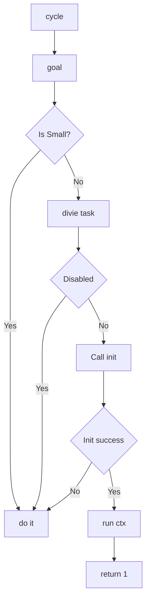

# 
人类机器的运作机制

触发器

满足相同条件就触发

## 
B=MAP
motivtion, 动机是波动的
ability, 难易程度=个人能力大小，时机，环境
prompt, 触发信号往往被忽略

## action step

1. Which part is Motivation? Which part is Ability? Which part is Prompt?

wake up and mon no at home, play game
fun strategy, 

